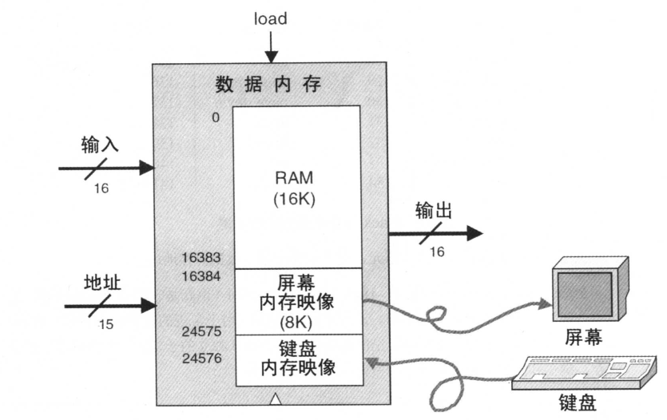
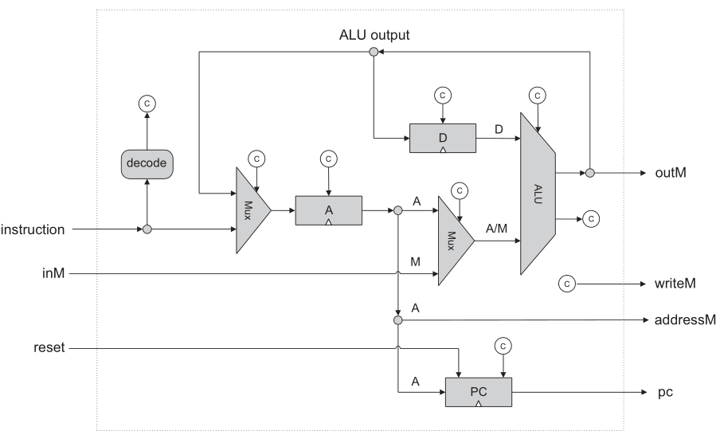
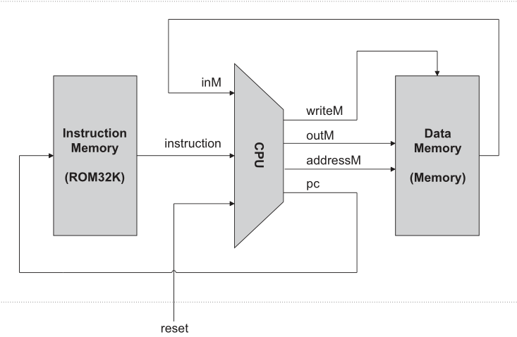

# Project 05

project 5的目标是构建Hack计算机平台。

步骤如下：

1. 内存

   内存由三个部分组成：RAM16K、Screen、Keyboard。

   

由图可以看出，对于任何地址>24567的内存访问时非法的。

功能为：

 out(t)=Memory\[address(t)\]\(t\)，即若不进行load则输出内存中的数据。

 If load(t-1) then Memory\[address(t-1)\](t)=in(t-1)，即若load则将地址中的内容存入in(t-1)。

因为键盘内存映射为0x6000,屏幕映射为0x4000-0x5FFF。因此先判断是读取RAM还是非RAM，如果读取非RAM区则判断读取屏幕还是键盘。

因为RAM16K地址为0到16383，则16384（‭0100000000000000‬）为界限，因此利用DMux，sel=address[14]来判断ARM区或者非RAM区。

而屏幕的内存映射为16384（‭0100000000000000‬）到24576（‭0110000000000000‬），观察可以看出判断的位置为address[13]。

```vhdl
CHIP Memory {
    IN in[16], load, address[15];
    OUT out[16];

    PARTS:
    // Put your code here:
    DMux(in=load, sel=address[14], a=ram, b=notRam);
    RAM16K(in=in, load=ram, address=address[0..13], out=ramOut);
   
    DMux(in=notRam, sel=address[13], a=scr, b=kbdOrNot);
    Screen(in=in, load=scr, address=address[0..12], out=scrOut);
    
    Or16Way(in[0..12]=address[0..12], in[13..15]=false, out=notKbd);
    Keyboard(out=kbdOut);
    Mux16(a=kbdOut, b=false, sel=notKbd, out=kbdOutFlag);
    Mux16(a=scrOut, b=kbdOutFlag, sel=address[13], out=ScrOrKbdOut);
    Mux16(a=ramOut, b=ScrOrKbdOut, sel=address[14], out=out);
}
```

2. CPU

   CPU的实现形式

   

3. computer

   计算机的组成结构

   